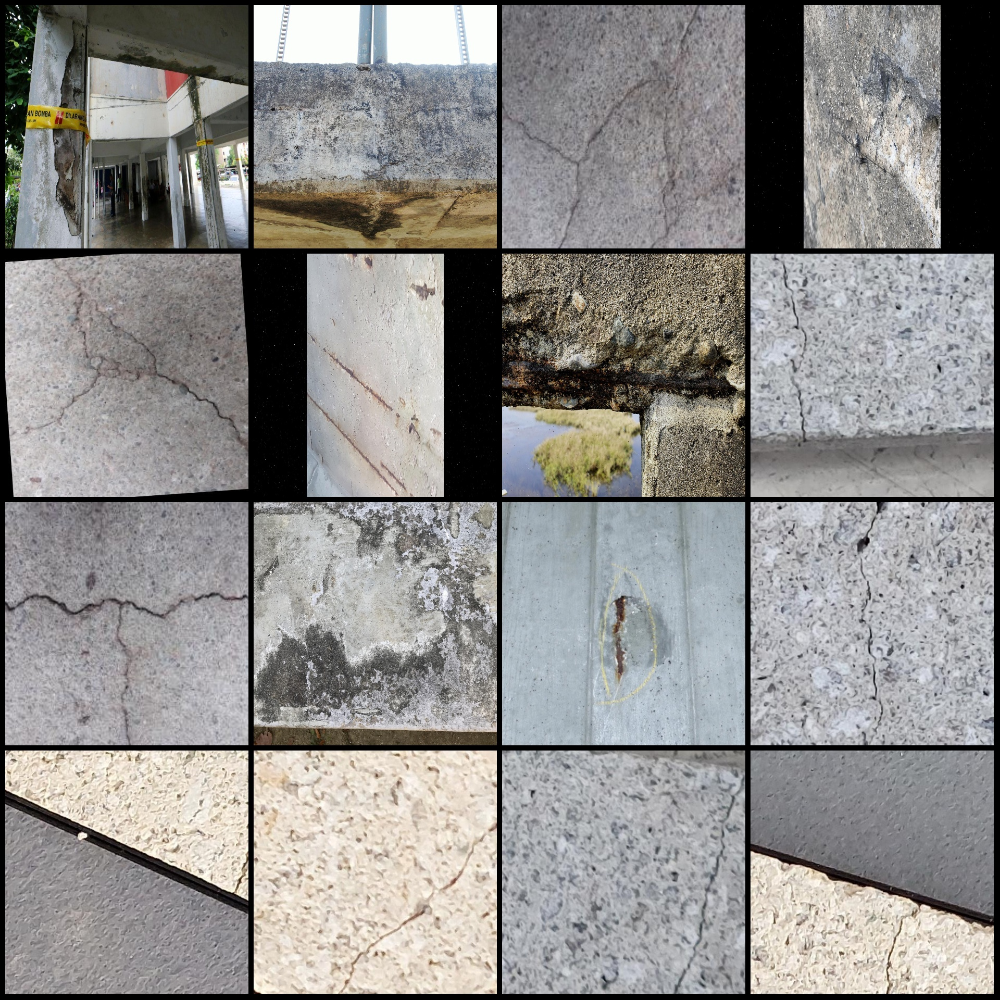
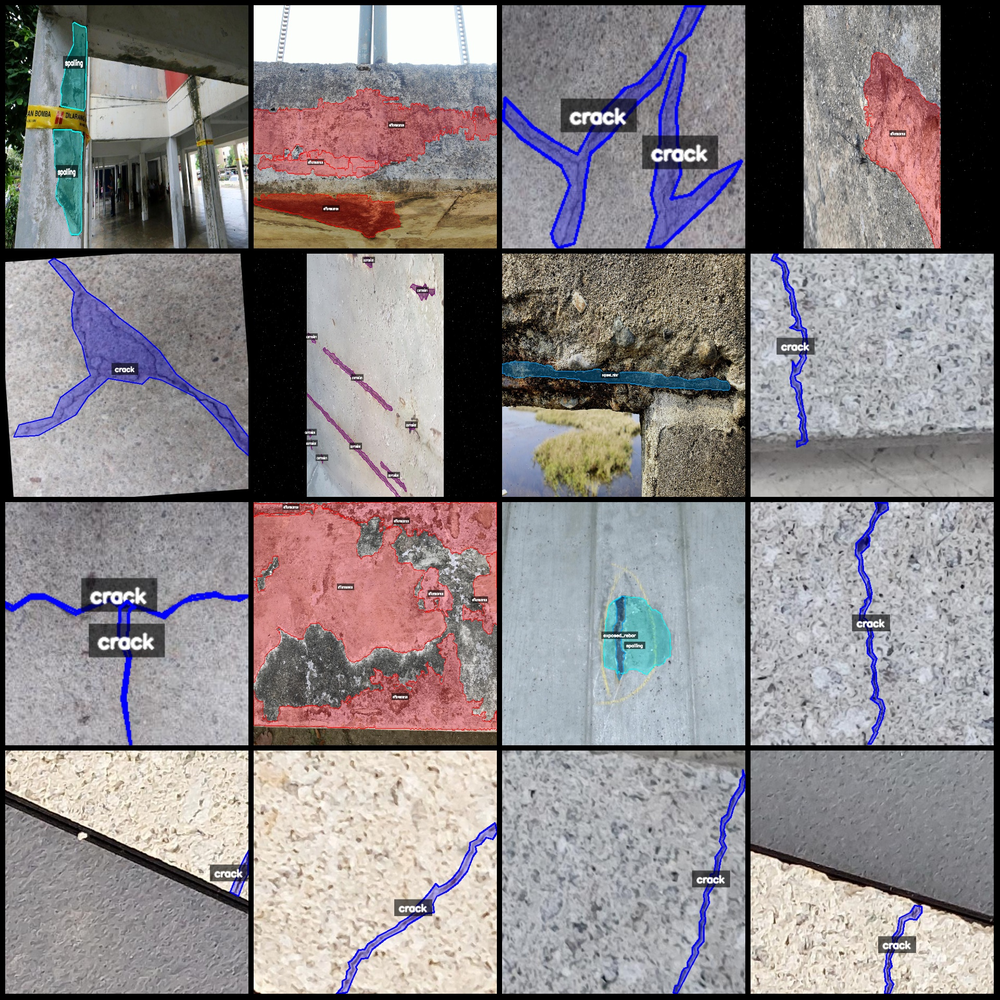
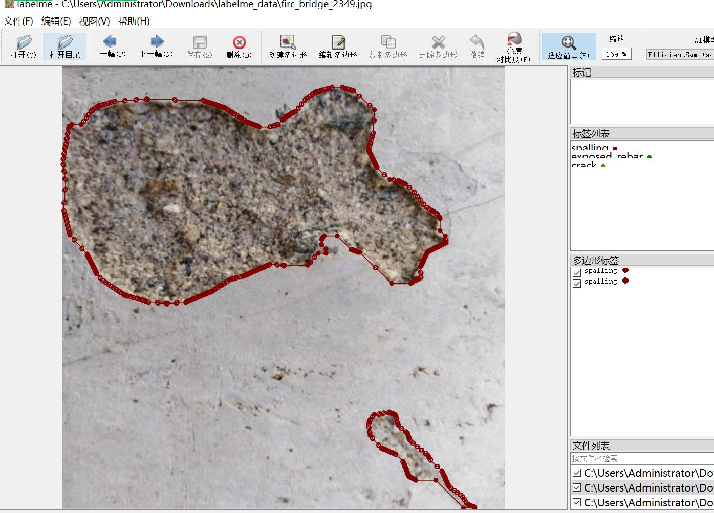

# Bridge Defect Segmentation Dataset in LabelMe format with 5341 images in 5 categories

Dataset format: labelme format (without mask files, only containing jpg images and corresponding json files)  
Number of images (jpg file counts): 5341  
Number of annotations (json file counts): 5341  
Number of categories: 5  
Annotation category names: ["corrosion", "crack", "efflorescence", "exposed_rebar", "spalling"]  
Number of bounding boxes for each category:  
corrosion (steel corrosion) count = 4409  
crack (cracks) count = 2333  
efflorescence (efflorescence/salting) count = 2965  
exposed_rebar (exposed rebar) count = 3714  
spalling (concrete spalling) count = 2245  
Total bounding boxes: 15666  
Annotation tool used: labelme=5.5.0  
Image resolution: multi-resolution images, such as 227x227, 2048x1152, etc.  
Annotation rules: draw polygons for categories  
Important Notice: You can open the dataset with labelme editor, and the json dataset needs to be converted into mask or yolo format or coco format for semantic segmentation or instance segmentation.  
Special Notice: This dataset does not guarantee the accuracy of the trained model or weight files.  
Image preview:  
Annotation examples:  
Original images (randomly select 16 images):  
Annotation drawing results:  
Labelme editing image example:
## Images

Here is a pay link on Stripe ( https://buy.stripe.com/3cs8yP7sY87d0vu9AB ). Please contact me lonlonago@foxmail.com after funding $89, and I will send you a complete data files , thank you!

